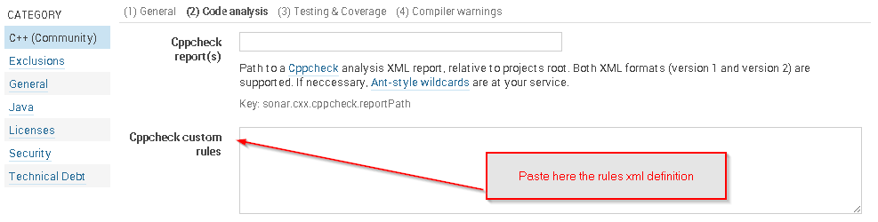
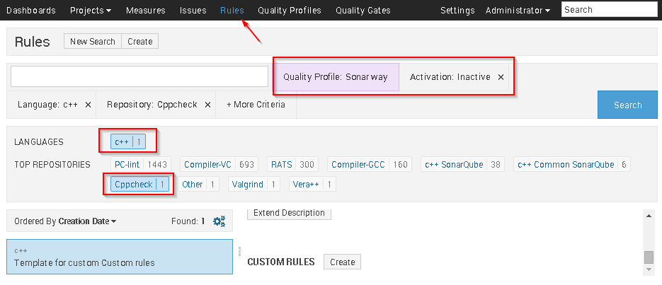
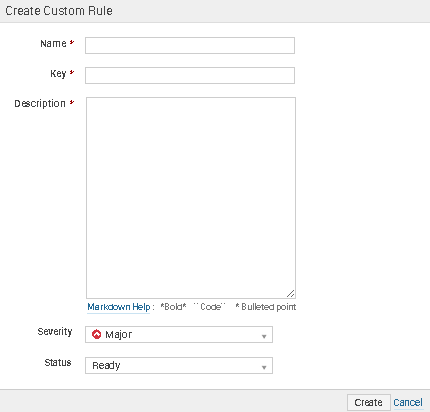
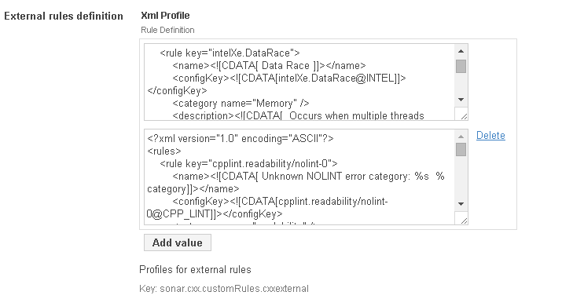

****Note: Defining rules in extensions/rules folder in SonarQube server is no longer supported by this plugin****

## Extending rules in supported code analysers

If you're using a patched or not-yet-supported version of an integrated code checker (like Cppcheck), you probably want to see those new checks in SonarQube, too. To do this, you have 2 different approachs availalbe.

### Using a xml definition ###

1. Define those rules using the XML format described further below in a temporary file.
2. Paste the content of file into the relevant configuration property in the SonarQube server. For example for cppcheck.
   
3. Restart the SonarQube server (This is the drawback of this method).
4. Make sure the newly added rules are visible in the quality profile; enable them
5. Run the analysis

####  Properties ####
  <table>
  <tr>
  <td><b>Property</b></td>
  <td><b>Description</b></td>
  </tr>
  <tr>
  <td>sonar.cxx.cppcheck.customRules</td>
  <td>Cppcheck Custom Rules</td>
  </tr>
  <tr>
  <td>sonar.cxx.valgrind.customRules</td>
  <td>Valgrind Custom Rules</td>
  </tr>
  <tr>
  <td>sonar.cxx.pclint.customRules</td>
  <td>PClint Custom Rules</td>
  </tr>
  <tr>
  <td>sonar.cxx.rats.customRules</td>
  <td>RATS Custom Rules</td>
  </tr>
  <tr>
  <td>sonar.cxx.vera.customRules</td>
  <td>Vera++ Custom Rules</td>
  </tr>
  <tr>
  <td>sonar.cxx.other.rules</td>
  <td>Unsupported Code Checker Custom Rules, see below</td>
  </tr>
  <table>

### The format of the rules file
The format of rules file is expected to be the following ([RulesDefinitionXmlLoader](http://javadocs.sonarsource.org/4.4/apidocs/org/sonar/api/server/rule/RulesDefinitionXmlLoader.html)):

V0.9.3 and later:
```XML
<rules>
   <rule>
     <!-- required fields -->
     <key>the-rule-key</key>
     <name>The purpose of the rule</name>

     <!-- optional fields -->
     <description>
       <![CDATA[The description]]>
     </description>
     <internalKey>Checker/TreeWalker/LocalVariableName</internalKey>
     <severity>BLOCKER</severity>
     <cardinality>MULTIPLE</cardinality>
     <status>BETA</status>
     <param>
       <key>the-param-key</key>
       <tag>style</tag>
       <tag>security</tag>
       <description>
         <![CDATA[the param-description]]>
       </description>
       <defaultValue>42</defaultValue>
     </param>
     <param>
       <key>another-param</key>
     </param>

     <!-- deprecated fields -->
     <configKey>Checker/TreeWalker/LocalVariableName</configKey>
     <priority>BLOCKER</priority>
   </rule>
 </rules>
```
Deprecated but still supported:
```XML
<rules>
  <rule key="RULE_ID">
    <name><![CDATA[ ... put here the human readable name of this rule ... ]]></name>
    <configKey><![CDATA[RULE_ID@$(EXTERNALSENSORCLASS)]]></configKey>
    <category name=" ... category type ... " />
    <description><![CDATA[ ... put here the human readable description of this rule ... ]]></description>
  </rule>
</rules>
```

Where the fields have the following semantics:

<table>
<tr>
<td><b>Tag/Attribute</b></td>
<td><b>MySql</b></td>
<td><b>Semantic</b></td>
</tr>

<tr>
<td>key [RULE_ID]</td>
<td>varchar(200)</td>
<td>Id of the rule, should match the ID in the external reports.<br>Note: Only alphabetic characters, digits and underscores are permitted for declaring the key. First sign should not be a digit.</td>
</tr>

<tr>
<td>name</td>
<td>varchar(200)</td>
<td>Can be really anything, in the quality profile in SonarQube its the first name that is displayed per rule</td>
</tr>

<tr>
<td>configKey</td>
<td>varchar(500)</td>
<td>This key is used later by the sensor to configure the code analyzer ([Extending+Coding+Rules] (http://docs.codehaus.org/display/SONAR/Extending+Coding+Rules)) </td>
</tr>

<tr>
<td>category name</td>
<td></td>
<td>Can be anything, examples include Maintainability Style Usability etc</td>
</tr>

<tr>
<td>description</td>
<td>mediumtext</td>
<td>In the quality profile in SonarQube UI, the description will be show after expanding each rule</td>
</tr>

</table>

Example:

```XML
<?xml version="1.0" encoding="UTF-8" standalone="yes"?>
<rules>
  <rule key="Te0001DataContextCannotBeSet">
    <name><![CDATA[Te0001DataContextCannotBeSet]]></name>
    <configKey>
      <![CDATA[Te0001DataContextCannotBeSet@PC_LINT]]>
    </configKey>
    <category name="Maintainability" />
    <description>
      <![CDATA[ Data Context Should no be set, please use another approach ]]>
    </description>
  </rule>
</rules>
```
It is also possible to add hyperlinks to the description, use ```<a>``` tags.
```HTML
<description>
  <![CDATA[<a href="http://example.com/xyz.html">Link</a>]]>
</description>
```

### SQALE characteristics (>= V0.9.4) ###
Starting with the version 0.9.4 it is also possible to define SQALE characteristics for other rules. To define the SQALE characteristics an extra XML file has to be defined and assigned to ```sonar.cxx.other.sqales```. Assign the XML file on server side to the configuration property on the page 'C++ settings / (2) Code analysis' and restart the server to enable it (same as with rule definitions). The XML file must fit the [XML schema for SQALE characteristics](https://github.com/wenns/sonar-cxx/blob/master/sonar-cxx-plugin/src/main/resources/com/sonar/sqale/cxx-model-project.xsd). For more complex examples have a look to the folder [SQALE](https://github.com/wenns/sonar-cxx/blob/master/sonar-cxx-plugin/src/main/resources/com/sonar/sqale/).

Example:

```XML
<sqale>
  <chc>
    <key>PORTABILITY</key>
    <name>Portability</name>
    <chc>
      <key>COMPILER_RELATED_PORTABILITY</key>
      <name>Compiler related portability</name>
      <chc>
        <rule-repo>other</rule-repo>
        <rule-key>key</rule-key>
        <prop>
          <key>remediationFunction</key>
          <txt>linear_offset</txt>
        </prop>
        <prop>
          <key>remediationFactor</key>
          <val>5</val>
          <txt>mn</txt>
        </prop>
        <prop>
          <key>offset</key>
          <val>10</val>
          <txt>mn</txt>
        </prop>
      </chc>
    </chc>
  </chc>
</sqale>
```

### Using Template Rules ###
This method allows the creation of rules on the fly, no need to for server restart. To do this follow these steps.

1. Locate the relevant custom rule for the code checker you want to extend.

2. Press create and fill in the details 

3. Enable the rule and run a new analysis 

*These rules can be created using the rest api, see [https://github.com/jmecsoftware/QualityProfileEditorPlugin](https://github.com/jmecsoftware/QualityProfileEditorPlugin "Quality Editor Plugin") as an example*

## Usage of unsupported code checkers ##
If you're using a code checker which is **not** supported by the plugin, this feature is for you. It allows to feed violations into SonarQube in a code checker agnostic way. To do this follow the steps below:

1. Create a XML file describing the rules and place it in code analysis settings of the plugin in the SonarQube server under the property sonar.cxx.other.rules
   
   Use the format described above. You can import multiple custom rules by clicking the Add value and save the settings

2. Run your checker and create a report

3. Transform the report such that it conform to the following RNG schema:
   ```XML
   <element name="results" xmlns="http://relaxng.org/ns/structure/1.0">
     <zeroOrMore>
       <element name="error">
         <attribute name="file"/>
         <attribute name="msg"/>
         <attribute name="id"/>
         <attribute name="line">
           <data type="integer" datatypeLibrary="http://www.w3.org/2001/XMLSchema-datatypes" />
         </attribute>
         <text/>
       </element>
     </zeroOrMore>
   </element>
   ```

  Where the fields have the following semantics:

  <table>
  <tr>
  <td><b>Tag/Attribute</b></td>
  <td><b>Semantic</b></td>
  </tr>

  <tr>
  <td>file</td>
  <td>Source file, relative to project path</td>
  </tr>

  <tr>
  <td>line</td>
  <td>Line number where the violation occurres</td>
  </tr>

  <tr>
  <td>id</td>
  <td>The ID of the violated SonarQube rule</td>
  </tr>

  <tr>
  <td>msg</td>
  <td>Description of the violation</td>
  </tr>
  <table>
4. Set the property **sonar.cxx.other.reportPath** to point to the location of transformed report (relative to project root) and run one analysis.


### Resources

Below you find a list of code analyzers which have already been integrated using this feature and according resources. The setups have been proven to work in one particular environment; you may need to adapt it to make work in yours.


<table>
<tr>
<td>Tool</td>
<td>Usage</td>
</tr>

<tr>
<td><a href="http://google-styleguide.googlecode.com/svn/trunk/cpplint/cpplint.py">cpplint</a></td>
<td>
<ol>
<li>Create the rules profile using the <a href="https://github.com/wenns/sonar-cxx/blob/master/sonar-cxx-plugin/src/tools/cpplint_createrules.py">profile creator script</a>:
<br>
<code>python cpplint_createrules.py cpplint.py</code>
<br>
This will generate the following files:
<ul>
<li>
<b>cpplint.xml</b>: that should be copied to $SONARQUBEHOME/extensions/rules/cxxexternal
</li>
<li>
<b>cpplint_mod.py</b>: that should be used to check the code
</li>
<br>
</li>
<li>
After this you can run the cpplint_mod.py against any source file like this:
<br>
<code>python cpplint_mod.py source.cpp 2> report.txt</code>
<br>
The output file report.txt needs to be converted to the XML format described above. For convenience a Perl script is available
<a href="https://github.com/wenns/sonar-cxx/blob/master/sonar-cxx-plugin/src/tools/cpplintReport2checkstyleReport.perl">here</a>
and can be run as follows:
<code>perl cpplintReport2checkstyleReport.perl report.txt splint-result-0.xml</code>
</li>
</td>
</tr>

<tr>
<td><a href="http://software.intel.com/en-us/intel-inspector-xe">Intel Inspector XE 2013</a></td>
<td>

<ol>
<li>Copy the
<a href="https://github.com/wenns/sonar-cxx/blob/master/sonar-cxx-plugin/src/main/resources/external/intel_inspector_rules.xml">Intel Inspector rules</a>
to $SONARQUBEHOME/extension/rules/cxxexternal and restart the server
</li>
<li>Modify the used SonarQube quality profile to accommodate the newly added rules</li>
<li>Run your test/application using the Intel Inspector and generate a CSV report</li>
<li>Convert the report with:
<code>python <a href="">intelInspectorReport_2_cppcheckReport.py</a>
in.csv out.xml <path to project> <test executable></code>
The out.xml can be then used during the analysis to feed the Intel Inspector results into
SonarQube.
</li>
</td>
</tr>
</table>
