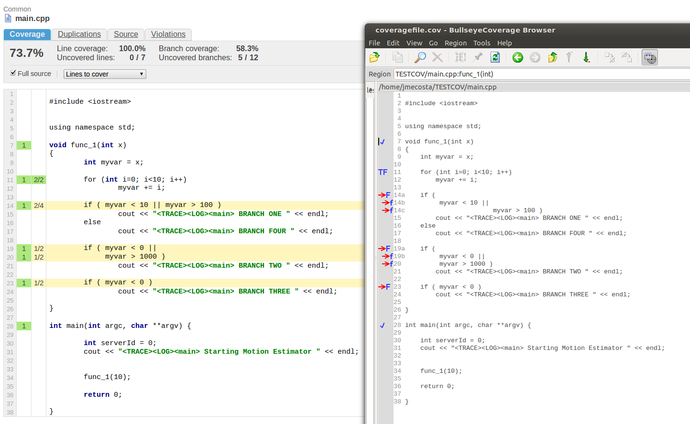
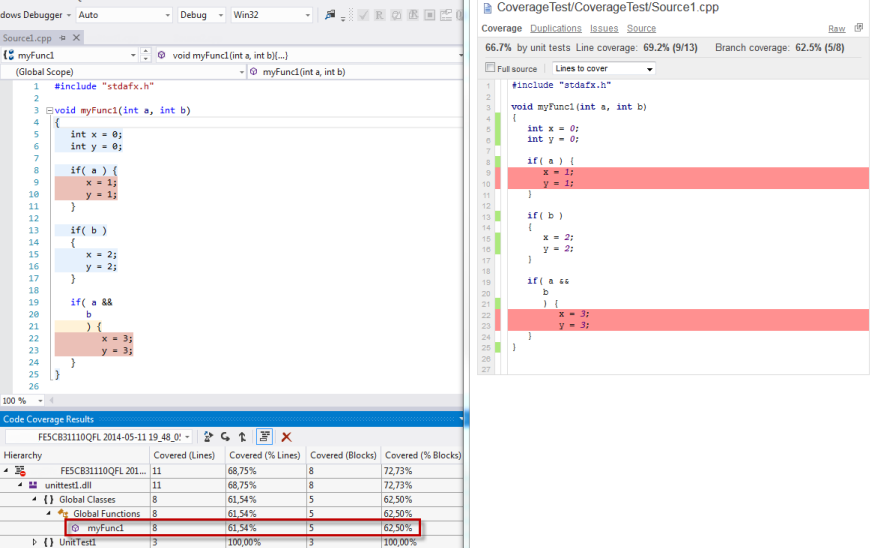

### It is not all the same

Talking about coverage the most important question is: what coverage your are talking about? There are different kinds of coverage measurement and each tool has a slightly different way doing it and displaying the results. If you are looking for a very good introduction read [Code Coverage Analysis](http://www.bullseye.com/coverage.html) on the [Bullseye](http://www.bullseye.com) page.

SonarQube API provides the possibility to set the covered lines (setHits) and covered conditions (setConditions). All other metrics are derived from these settings:

* __Line coverage__: On a given line of code, Line coverage simply answers the following question: Has this line of code been executed during the execution of the unit tests?
* __Conditions by line / Covered conditions by line__: These are the number of conditions by line and number of covered conditions by line.
* __Branch coverage__: On each line of code containing some boolean expressions, the branch coverage simply answers the following question: 'Has each boolean expression been evaluated both to true and false?'. This is the density of possible branches in flow control structures that have been followed during unit tests execution.
* __Coverage__: It is a mix of Line coverage and Branch coverage. Its goal is to provide an even more accurate answer to the following question: How much of the source code has been covered by the unit tests?

For more details and exact calculation see [Metric Definitions](http://docs.codehaus.org/display/SONAR/Metric+definitions#Metricdefinitions-Tests) on the SonarQube page.

### Setup the C++ Community Plugin

To collect C++ test coverage metrics with C++ Community Plugin, you have to:

1. Create a coverage report with an external tool (or many of them). For some examples how to use your favorite coverage tracer see [[Coverage tracers]].
2. Configure your project to point to the report and rerun the analysis.

Three types of test coverage are supported:  _Unit test_, _Integration test_ and _Overall_ coverage. Use one of the following configuration properties dependent of the coverage type (see also [[Supported configuration properties]] for details):

* **sonar.cxx.coverage.reportPath** for unit test coverage
* **sonar.cxx.coverage.itReportPath** for integration test coverage (until V0.9.9)
* **sonar.cxx.coverage.overallReportPath** for overall test coverage (until V0.9.9)

The plugin handles the three coverage types independent from each other and will do no aggregation for e.g. overall test coverage. Your external tool suite is responsible for combining the different coverage reports and providing three reports.

The C++ Community plugin accepts three different formats for the test coverage reports, which will be recognized automatically:

* Cobertura XML: the format introduced by [Cobertura](http://cobertura.github.io/cobertura/).
* The XML format used by [Bullseye](http://www.bullseye.com/).
* The XML format used by [Microsoft Visual Studio](http://msdn.microsoft.com/de-de/library/dd537628.aspx).

SonarQube V6.7.x will assign zero line coverage to source files without coverage reports, which results in a more realistic overall Technical Debt value. 

### Notes for BullseyeCoverage users:
SonarQube <3.2 provides metrics for line coverage and branch coverage. Bullseye users have function and branch/decision coverage instead. The C++ Community plugin converts the branch/decision coverage directly into branch coverage however line coverage is far more complex and cannot be correlated directly into function coverage.

Line coverage imported from a bullseye report means than function coverage + line branch coverage (this second occurs since SonarQube will not display branch coverage if there isn't a line it associated with it). This means also that overall coverage will be affected in SonarQube and cannot be compared directly to Bullseye results. The following pictures illustrates this for a small example project.



### Notes for Visual Studio coverage users

Prerequisites
* Visual Studio Premium or Visual Studio Ultimate 2010 to 2017 Enterprise edition.
* MSDN: [Using Code Coverage to Determine How Much Code is being Tested](http://msdn.microsoft.com/de-de/library/dd537628.aspx)

Visual Studio provides block or line coverage:
* __block coverage__:  A block is a piece of code with exactly one entry and exit point. If the program’s control flow passes through a block during a test run, that block is counted as covered. The number of times the block is used has no effect on the result. The block coverage is only on function level available. Block coverage is not supported by SonarQube.
* __line coverage__: Counts the number of executed lines of code. A line could be covered (covered="yes"), not covered (covered="no") or partial covered (covered="partial").

Mapping this to the SonarQube model results in:
* Condition coverage within the code is not available.
* SonarQube does not support partial covered lines. Partial covered lines are marked as covered.

See below an example for coverage results calling with **myFunc(0, 1)**:
The partial covered line 21 is marked as covered in SonarQube. This results also in another line coverage:
* Visual Studio: covered [lines] 8; covered [%] 61,54%
* SonarQube: covered [lines] 9; covered [%] 69,2%



Resulting Visual Studio XML coverage file:

```XML
<?xml version="1.0" encoding="UTF-8" ?>
<results>
  <modules>
    <module name="unittest1.dll" path="unittest1.dll" id="93AA4138F7AFB24C91DC9614B700B83C07000000" block_coverage="72.73" line_coverage="68.75" blocks_covered="8" blocks_not_covered="3" lines_covered="11" lines_partially_covered="1" lines_not_covered="4">
      <functions>
        <function id="77200" name="myFunc1" type_name="" block_coverage="62.50" line_coverage="61.54" blocks_covered="5" blocks_not_covered="3" lines_covered="8" lines_partially_covered="1" lines_not_covered="4">
          <ranges>
            <range source_id="0" covered="yes" start_line="4" start_column="0" end_line="4" end_column="0" />
            <range source_id="0" covered="yes" start_line="5" start_column="0" end_line="5" end_column="0" />
            <range source_id="0" covered="yes" start_line="6" start_column="0" end_line="6" end_column="0" />
            <range source_id="0" covered="yes" start_line="8" start_column="0" end_line="8" end_column="0" />
            <range source_id="0" covered="no" start_line="9" start_column="0" end_line="9" end_column="0" />
            <range source_id="0" covered="no" start_line="10" start_column="0" end_line="10" end_column="0" />
            <range source_id="0" covered="yes" start_line="13" start_column="0" end_line="13" end_column="0" />
            <range source_id="0" covered="yes" start_line="15" start_column="0" end_line="15" end_column="0" />
            <range source_id="0" covered="yes" start_line="16" start_column="0" end_line="16" end_column="0" />
            <range source_id="0" covered="partial" start_line="21" start_column="0" end_line="21" end_column="0" />
            <range source_id="0" covered="no" start_line="22" start_column="0" end_line="22" end_column="0" />
            <range source_id="0" covered="no" start_line="23" start_column="0" end_line="23" end_column="0" />
            <range source_id="0" covered="yes" start_line="25" start_column="0" end_line="25" end_column="0" />
          </ranges>
        </function>
      </functions>
      <source_files>
        <source_file id="0" path="x:\coveragetest\source1.cpp" checksum_type="MD5" checksum="8A4EC27BE0FE2BCE77401F836581836D">
        </source_file>
      </source_files>
    </module>
  </modules>
</results>
```
