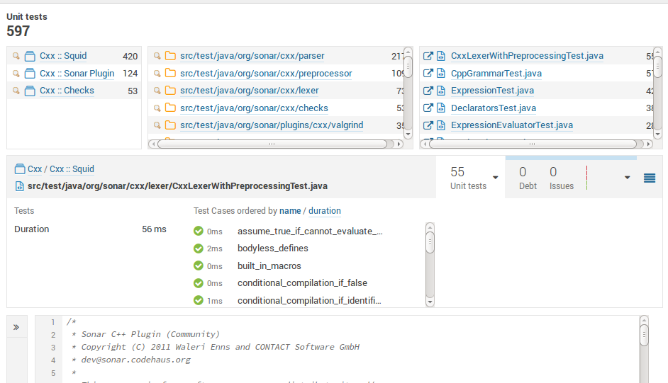

To collect test execution metrics with the C++ Community plugin follow
the steps below:

1. Get an execution report out of your favorite test framework. See
[[Test runners]] for examples. The reports has to be JUnitReport-like, for details see ....

2. Configure your SonarQube project by setting the property
**sonar.cxx.xunit.reportPath** to point to the created report[s] and
rerun the analysis.

By default, the JUnitReport format is expected. To import a report in
an other format _X_, set the property **sonar.cxx.xunit.xsltURL** to a
XSLT stylesheet which is able to perform X -> JUnitReport
conversion. A couple of ready-made stylesheets are available
[here](https://github.com/wenns/sonar-cxx/tree/master/sonar-cxx-plugin/src/main/resources/xsl):

* boosttest-1.x-to-junit-1.0.xsl:       For transforming Boost-reports
* cpptestunit-1.x-to-junit-1.0.xsl:     For transforming CppTestUnit-reports
* cppunit-1.x-to-junit-1.0.xsl:         For transforming CppUnit-reports

## Simple and detailed modes
The test execution reports can be imported in two modes: 'simple' and
'detailed', configurable via the configuration property
**sonar.cxx.xunit.provideDetails**. In the simple mode, the plugin doesn't
try to assign the testcases found in the execution report to test
source files in SonarQube, it just aggregates the numbers and assigns
them to the project, yielding numbers like:


That's the easiest and fastest way to get results, but you lose the
ability to drill down to test execution details. To also gain it, do the following:

1. Configure the locations of your tests using the property
**sonar.tests** and according exclusion/inclusion properties (see
[SonarQube analysis parameters](http://docs.sonarqube.org/display/SONAR/Analysis+Parameters) for
details).

2. Now help the plugin to assign the testcases found in the reports to
the tests you configured in the previos step. There are two ways to
do that:

a. Check that your test sources can be parsed by the plugin (use the
log file to control that). Run the analysis and make sure all
testcases can be assigned, i.e. the log file doesn't contain messages
like:

```
WARN  - ... no resource found, the testcase '??' has to be skipped
```

b. Alternatively (or complementary, to address remaining cases) one
can augment the reports either by adding a *filename* attribute to the
*testsuite* or the *testcase* tag.  The values of those attributes
should hold a path to the according source file, relative to projects
root, e.g.:

```XML
<testsuite name="ts" filename="tests/mytest.cc" ... >
  ... testcases ...
</testsuite>
```

and/or

```XML
...
    <testcase name="tc" filename="tests/myothertest.cc" ... />
...

```

Done right, this allows drilling down to the details:




## Supported reports
JUnitReport is not really a standard. There are many flavors out
there, which usually differ in subtle details. The reports supported
by this plugin look like follows:

```XML
...
<testsuite name="ts"
           filename="some path" ... >

  <!-- optional: the testsuites can be nested: -->
  <testsuite name="nested ts"
           filename="some path" ... >

    <testcase name="tc1" status="run" time="0.05" classname="classA"
              filename="some path"/>
    <testcase name="tc2" status="run" time="0" classname="classB">
      <failure message="..." type="">
        <![CDATA[test_component1.cc:17
                 Value of: 112
                 Expected: bar.foo()
                 Which is: 111]]>
      </failure>
    </testcase>
  </testsuite>
  ...
</testsuite>
...
```

For details consult the
[schema](https://github.com/wenns/sonar-cxx/blob/master/integration-tests/features/xunit.rnc)
(written using 'Relax NG Compact' syntax)
