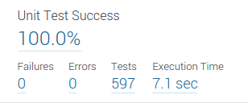

To collect test execution metrics with the C++ Community plugin follow
the steps below:

1. Get an execution report out of your favorite test framework. See
[[Test runners]] for examples. The reports has to be JUnitReport-like, for details see ....

2. Configure your SonarQube project by setting the property
**sonar.cxx.xunit.reportPath** to point to the created report[s] and
rerun the analysis.

By default, the JUnitReport format is expected. To import a report in
an other format _X_, set the property **sonar.cxx.xunit.xsltURL** to a
XSLT stylesheet which is able to perform X -> JUnitReport
conversion. A couple of ready-made stylesheets are available
[here](https://github.com/wenns/sonar-cxx/tree/master/sonar-cxx-plugin/src/main/resources/xsl):

* boosttest-1.x-to-junit-1.0.xsl:       For transforming Boost-reports
* boosttest-1.x-to-junit-dummy-1.0.xsl: For transforming Boost-reports, simulating virtual files
* cpptestunit-1.x-to-junit-1.0.xsl:     For transforming CppTestUnit-reports
* cppunit-1.x-to-junit-1.0.xsl:         For transforming CppUnit-reports

## Simple and detailed modes
The test execution reports can be imported in two modes: 'simple' and
'detailed', configurable via the configuration property
**sonar.cxx.xunit.provideDetails**. In the simple mode, which is the default, the plugin doesn't
try to assign the testcases found in the execution report to test
source files in SonarQube, it just aggregates the numbers and assigns
them to the project, yielding numbers like:



That's the easiest and fastest way to get results, but you lose the
ability to drill down to test execution details. To also gain it, do the following:

1. Configure the locations of your tests using the property
**sonar.tests** and according exclusion/inclusion properties (see
[SonarQube analysis parameters](http://docs.sonarqube.org/display/SONAR/Analysis+Parameters) for
details).

2. Now help the plugin to assign the testcases found in the reports to
the tests you configured in the previous step. There are two ways to
do that:

a. Check that your test sources can be parsed by the plugin (use the
log file to control that). Run the analysis and make sure all
testcases can be assigned, i.e. the log file doesn't contain messages
like:

```
WARN  - ... no resource found, the testcase '??' has to be skipped
```

b. Alternatively (or complementary, to address remaining cases) one
can augment the reports either by adding a *filename* attribute to the
*testsuite* or the *testcase* tag.  The values of those attributes
should hold a path to the according source file, relative to projects
root, e.g.:

```XML
<testsuite name="ts" filename="tests/mytest.cc" ... >
  ... testcases ...
</testsuite>
```

and/or

```XML
...
    <testcase name="tc" filename="tests/myothertest.cc" ... />
...

```

Done right, this allows drilling down to the details:


## Supported reports
JUnitReport is not really a standard. There are many flavors out
there, which usually differ in subtle details. The reports supported
by this plugin look like follows:

```XML
...
<testsuite name="ts" filename="some path" ... >

  <!-- optional: the testsuites can be nested: -->
  <testsuite name="nested ts"
           filename="some path" ... >

    <testcase name="tc1" filename="some path" status="run" time="0.05" classname="classA"/>
    <testcase name="tc2" status="run" time="0" classname="classB">
      <failure message="..." type="">
        <![CDATA[test_component1.cc:17
                 Value of: 112
                 Expected: bar.foo()
                 Which is: 111]]>
      </failure>
    </testcase>
  </testsuite>
  ...
</testsuite>
...
```

For details consult the
[schema](https://github.com/wenns/sonar-cxx/blob/master/integration-tests/features/xunit.rnc)
(written using 'Relax NG Compact' syntax)

**Hints:**
* The *filename* attribute is optional and plugin specific
* The *testsuite*-tags can be nested
* The root-tag can be also *testsuites*, the plugin just ignores that and processes enclosed *testsuite*-tags.

## Boost reports

Below is an example for a Boost unit test and the resulting report. There are different settings for ```log_level``` possible, ```log_level=test_suite``` is the recommended setting.

The Boost unit test framework is working with namespaces and not classes like other test frameworks.

**Source code of unit test:**
```C++
#define BOOST_TEST_MAIN
#include "boost/test/unit_test.hpp"

BOOST_AUTO_TEST_CASE(WithoutSuite)
{
	BOOST_REQUIRE(false);
}

BOOST_AUTO_TEST_SUITE(FirstLevel)

BOOST_AUTO_TEST_CASE(OnFirstLevel)
{
	BOOST_REQUIRE(false);
}

BOOST_AUTO_TEST_SUITE(SecondLevel)

BOOST_AUTO_TEST_CASE(OnSecondLevel)
{
	BOOST_REQUIRE(false);
}

BOOST_AUTO_TEST_SUITE(ThirdLevel)

BOOST_AUTO_TEST_CASE(OnThirdLevel)
{
	BOOST_REQUIRE(false);
}

BOOST_AUTO_TEST_SUITE_END()
BOOST_AUTO_TEST_SUITE_END()
BOOST_AUTO_TEST_SUITE_END()
```

**resulting boost unit test report (input for the transformation):**

```XML
<?xml version="1.0" encoding="utf-8"?>
<TestLog>
  <TestSuite name="Master Test Suite">
    <TestCase name="WithoutSuite">
      <FatalError file="c:/example/nestedsuitstest.cpp" line="9"><![CDATA[critical check false failed]]></FatalError>
      <TestingTime>0</TestingTime>
    </TestCase>
    <TestSuite name="FirstLevel">
      <TestCase name="OnFirstLevel">
        <FatalError file="c:/example/nestedsuitstest.cpp" line="16"><![CDATA[critical check false failed]]></FatalError>
        <TestingTime>0</TestingTime>
      </TestCase>
      <TestSuite name="SecondLevel">
        <TestCase name="OnSecondLevel">
          <FatalError file="c:/example/nestedsuitstest.cpp" line="23"><![CDATA[critical check false failed]]></FatalError>
          <TestingTime>0</TestingTime>
        </TestCase>
        <TestSuite name="ThirdLevel">
          <TestCase name="OnThirdLevel">
            <FatalError file="c:/example/nestedsuitstest.cpp" line="30"><![CDATA[critical check false failed]]></FatalError>
            <TestingTime>0</TestingTime>
          </TestCase>
        </TestSuite>
      </TestSuite>
    </TestSuite>
  </TestSuite>
</TestLog>
```


**Simulating virtual files (boosttest-1.x-to-junit-dummy-1.0.xsl, SQ 4.5 LTS only)**

In older versions it was possible to add unit test results with virtual file items only. To migrate from older versions you can use the transformation 'boosttest-1.x-to-junit-dummy-1.0.xsl'. The advantage is that you can use ```sonar.cxx.xunit.provideDetails=true``` and get at least a list of all unit tests with the execution times.

Create a subfolder below your project configuration file with a dummy unit test file. The file name must be 'dummy.cpp'. Additional you have to set ```sonar.tests=cxx-xunit``` and ````sonar.cxx.xunit.xsltURL=boosttest-1.x-to-junit-dummy-1.0.xsl```.

As a result you get 'detailed' unit test information pointing all to the file 'dummy.cpp'.

```
root-|
     |-- sonar-project.properties (see additional settings below)
     |      sonar.cxx.xunit.provideDetails=true
     |      sonar.cxx.xunit.xsltURL=boosttest-1.x-to-junit-dummy-1.0.xsl
     |      sonar.tests=cxx-xunit
     |-- cxx-xunit (additional subfolder)
               | dummy.cpp (dummy file in subfolder)
```