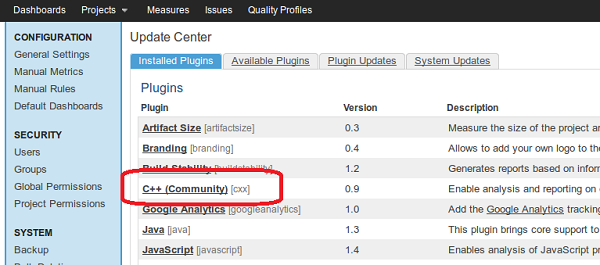

- Make sure you know which plugin release is compatible with your SonarQube instance (see [[SonarQube compatibility matrix]])
- Download one of the [released](https://github.com/wenns/sonar-cxx/releases) jar packages into the SONARQUBE_HOME/extensions/plugins directory
   - `sonar-cxx-plugin-x.y.z.jar`: is the c++ plugin
   - `sonar-c-plugin-x.y.z.jar`: is a first draft for a c plugin
   - `sslr-cxx-toolkit-x.y.z.jar`: Is an additional tool to create an AST from source code. Helpful to create XPath checks.
- Restart the SonarQube server
- Navigate to the Update Center (\<Your SonarQube URL\>/updatecenter). The Update Center should list "C++ (Community)" on the tab "Installed Plugins":

