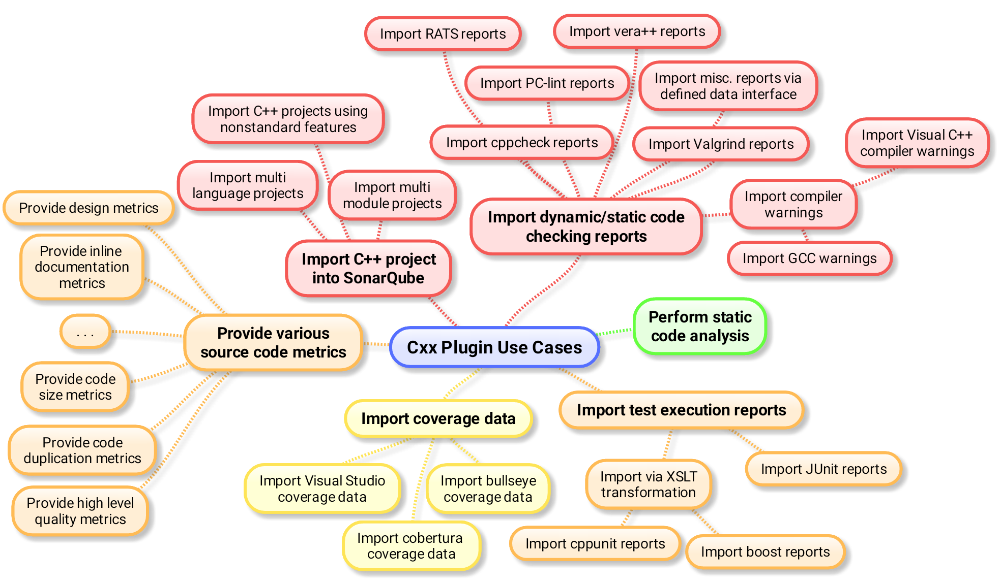

The plugin contains a small but growing
[integration test suite](https://github.com/wenns/sonar-cxx/tree/master/sonar-cxx-plugin/src/test/integration).

This testsuite is not only a means to check that the plugin works (or
works not) with a particular SonarQube version/setup. It also strives
to be a living use case documentation in style in spirit of
[BDD](http://en.wikipedia.org/wiki/Behavior-driven_development). The
following mind map gives an overview over use cases suppoted by this
plugin. The ultimate goal is to cover all of them by tests of this testsuite.



## Running the tests

### Preconditions

Make sure the following preconditions are met, before running the test suite:

* Python is installed
* behave (http://pythonhosted.org/behave/) is installed
* [request module](https://pypi.python.org/pypi/requests) is available ('pip install requests' may help)
* Optional: [colorama module](https://pypi.python.org/pypi/colorama/0.3.2) is installed ('pip install colorama')


### Usage
Either install the plugin, startup SonarQube manually and simply run:

```BASH
$ behave
```

from the project root folder or let the test suite do the job by
telling it the path to your SQ installation:

```BASH
$ SONARHOME=/path/to/SonarQube behave
```

In the latter case, the suite will automatically install and test the
jar in sonar-python-plugin/target. So make sure the plugin is build
and the jar is available.
