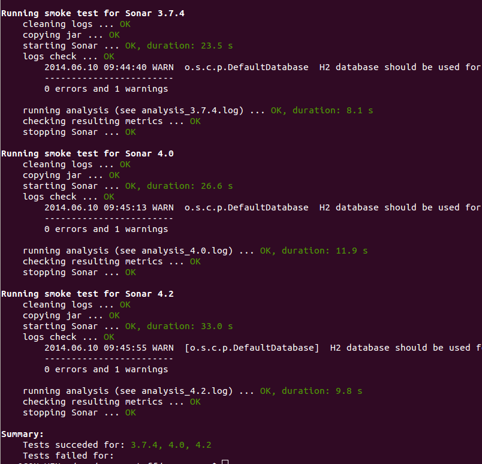

The plugin contains a small [integration test suite](https://github.com/wenns/sonar-cxx/tree/master/sonar-cxx-plugin/src/test/integration) which is able to perform smoketest-like checks for a given build. Currently, the  following checks are carried out:

- can the plugin be installed?
- can SonarQube be started with this plugin installed?
- does the log contain entries of type "WARN" and "ERROR"?
- does the analysis of a trivial project exit without errors?
- does the above analysis yield expected measures?

The above checks can be automatically run against multiple SonarQube installations which may differ in version, used database backend etc.

### Preconditions

Make sure the following preconditions are met, before running the test suite:

- Download, install and configure all SonarQube versions you would like to test against. Make sure they're installed in the same directory.
- Copy the sitedef:
```bash
$ cp sitedefs_sample.py sitedefs.py
```
and adjust its content (SONAR_HOME, SONAR_VERSIONS, etc.)  to fit your site
- Install [Python](https://www.python.org/)
- Install the [requests](https://pypi.python.org/pypi/requests) module (using e.g. ```pip install requests```)
- Optional: install the [colorama](https://pypi.python.org/pypi/colorama) module (using e.g. ```pip install colorama```) to get colorized output

### Usage
Just compile the plugin:
```bash
$ mvn clean istall
```
... and run the script 'smoketests' in a shell:

```bash
$ sonar-cxx-plugin/src/test/integration/smoketest
```

On Windows, call the interpreter explicitly:

```bash
$ python sonar-cxx-plugin\src\test\integration\smoketest
```

If all goes well, the run should yield an output like the following:



